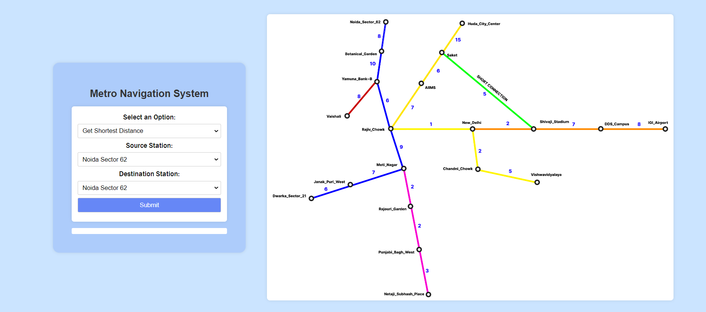
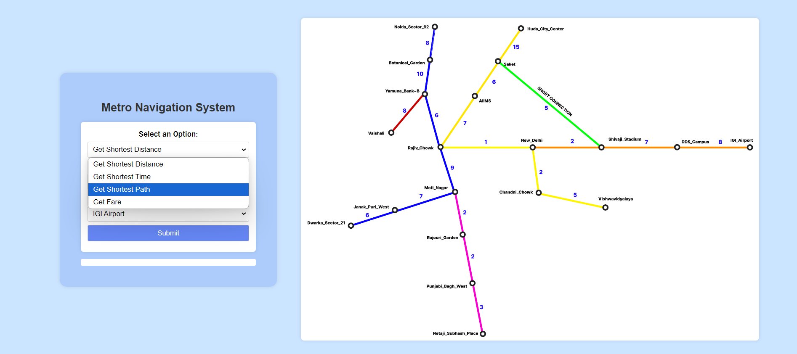
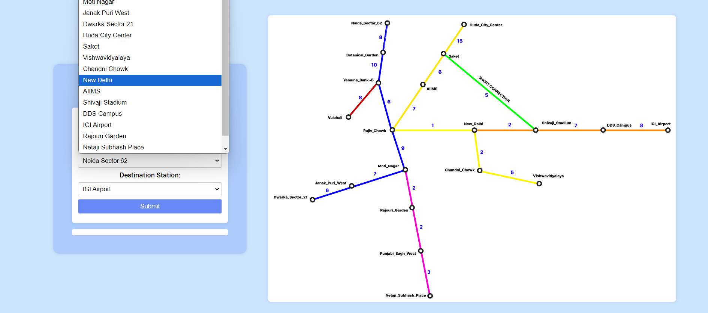
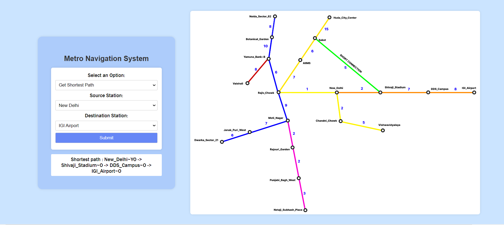

# Metro Route Navigator

Metro Route Navigator is a web application designed to help users find the shortest and most efficient metro route between stations in a metropolitan transit system. The app offers an interactive and user-friendly interface for navigating metro routes, checking route details, and planning journeys.
## Table of Contents

- [Features](#features)
- [Tech Stack](#techstack)
- [Installation](#installation)
- [Usage](#usage)
- [Screenshots](#screenshots)
  
## Features

- **Shortest Route Finder**: Quickly find the shortest route between two metro stations.
- **Color-coded Map**: Visual representation of metro lines and stations.
- **Journey Planner**: Plan your trips with estimated travel times, fare and station changes.
- **Responsive Design**: Accessible across multiple devices and screen sizes.

## Tech Stack

- **Frontend**: HTML, CSS, JavaScript
- **Backend**: Node.js (for future integration)

## Installation

1. Clone the repository:
   ```bash
   git clone https://github.com/radhika-gh/Metro-App.git
2. Navigate to the project directory:
   ```bash
   cd Metro-Route-Navigator
3. Open index.html in your web browser:
   ```bash
   open index.html
   
## Usage

- Open the application in your web browser.
- Enter the starting and destination stations.
- Select the type of information you need.
- The app will display selected information like shortest metro route , shorted distance between stations, the total travel time and necessary charges between lines.

## Screenshots
Here’s a preview of **Metro-Route-Navigator** in action:

### 1. Interface
This is the main interface of our web-app containing color-coded map of various connected metro stations.


### 2. Select the type of information needed
User can select the type of infomation like Shortest Distance, Minimum Time, Minimum Fare, etc.


### 3. Select Starting and Destination Station
Choose the Start and Destination Station from the drop-down menu.


### 4. Submit 
Submit details and get the desired information.

